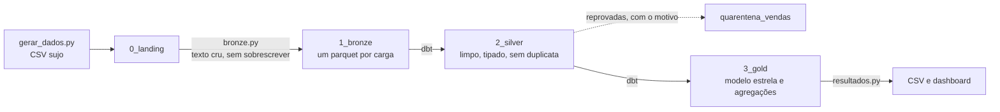
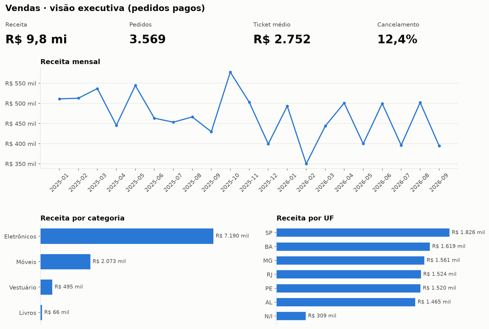

# Lakehouse medallion local

[](https://github.com/Falkzera/lakehouse-example/actions/workflows/ci.yml)

Pipeline de dados que recebe CSVs sujos e entrega tabelas confiáveis e um dashboard, passando pelas camadas bronze, silver e gold. Python carrega, o dbt transforma em SQL dentro do DuckDB, e cada passo tem teste.

O projeto foi desenvolvido com o Claude Code como par de programação (detalhes em [Como foi feito](#como-foi-feito)).





## Como rodar

Precisa de Python 3.14.

```bash
python3.14 -m venv .venv
source .venv/bin/activate
pip install -r requirements.txt

python pipeline/gerar_dados.py   # cria a fonte suja em lakehouse/0_landing
python pipeline/run.py           # bronze, silver e gold, com os testes do dbt no meio
pytest                           # testes da ingestão
```

Para ver o grafo de linhagem (de onde vem cada tabela):

```bash
cd dbt
dbt docs generate --profiles-dir . && dbt docs serve --profiles-dir .
```

## O que cada camada faz

| Camada | Quem faz | O que sai |
|---|---|---|
| **0_landing** | `pipeline/gerar_dados.py` | `clientes.csv` e `vendas.csv`, com a sujeira de um sistema real |
| **1_bronze** | `pipeline/bronze.py` | um parquet por carga, tudo como texto, mais `_arquivo_origem`, `_lote` e `_linha` |
| **2_silver** | `dbt/models/2_silver` | `clientes`, `vendas` e `quarentena_vendas`, mais o perfil das colunas e o placar da limpeza |
| **3_gold** | `dbt/models/3_gold` | modelo estrela (`fato_vendas` e as dimensões de cliente, produto e calendário) e as agregações de receita |
| **resultados** | `pipeline/resultados.py` | as agregações em CSV, que abrem direto no Excel em português, e o `dashboard.png` |

## Qualidade de dados

| Sujeira na fonte | Tratamento na silver |
|---|---|
| espaços, maiúscula e minúscula misturadas, acento faltando | `trim` e uma forma canônica (sem acento, maiúscula) para comparar |
| `""`, `N/A`, `null`, `-` | viram nulo de verdade |
| quatro formatos de data e datas como `31/02/2025` | tenta cada formato, e data impossível vai para a quarentena |
| `R$ 1.234,56`, `1234,56` e `1234.56` | viram `DECIMAL(12,2)` |
| `dois`, `0` e `-1` na quantidade | quarentena |
| UF como `sp`, `São Paulo` ou `Sao Paulo` | sigla, pela tabela de domínio `dominio_uf` |
| e-mail sem `@` | nulo |
| linhas repetidas e o mesmo código escrito como `c0001` e `C0001` | uma linha por chave normalizada |
| venda de cliente que não está no cadastro | quarentena |
| status fora de `pago`, `cancelado` e `pendente`, ou venda sem produto | quarentena |
| preço 100 vezes maior por erro de digitação | quarentena quando passa de 5 vezes a mediana do produto |

O perfil (`resultados/perfil_dados.csv`) mede cada coluna antes e depois. O efeito da padronização aparece na contagem de valores distintos.

| Coluna | Grafias na bronze | Valores na silver |
|---|---|---|
| produto | 40 | 8 |
| uf | 30 | 6 |
| categoria | 12 | 4 |
| status | 12 | 3 |

O placar (`resultados/qualidade.csv`) mostra o caminho das 5.120 vendas. Saem 120 duplicadas e 530 vão para a quarentena, cada uma com o motivo, e chegam 4.470 à silver.

## Testes

`dbt build` roda tudo na ordem certa e não constrói nada que dependa de um teste reprovado.

| Tipo | Quantos | O que garante |
|---|---|---|
| Testes unitários do dbt | 3 | as macros de limpeza e as regras de quarentena, com dado sujo inventado e a saída esperada |
| Testes de dados do dbt | 27 | chave única, nulos, valores aceitos e relação entre a fato e cada dimensão |
| Testes SQL próprios | 2 | nenhuma venda com quantidade ou preço menor ou igual a zero na silver, e as receitas mensal, por categoria e por UF somando o mesmo que os pedidos pagos da fato |
| pytest | 1 | a bronze guarda o texto exatamente como veio e uma carga nova não apaga a anterior |

O CI (`.github/workflows/ci.yml`) roda os testes e o pipeline inteiro a cada push na `main` e em todo pull request.

## Decisões

- **A bronze nunca sobrescreve.** Cada carga vira um arquivo novo, com o texto exatamente como chegou. Dá para reprocessar a silver quando uma regra mudar e para provar o que a fonte mandou. A coluna `_linha` aponta a linha do CSV de origem.
- **Reprovar em vez de apagar.** Linha com problema vai para a quarentena com o motivo, e o placar mostra quanto se perde e por quê. Apagar esconderia o defeito da fonte.
- **ELT de verdade.** O Python só carrega. Toda transformação é SQL versionado, que roda dentro do DuckDB e é testado pelo dbt.
- **DuckDB, e não Spark.** São milhares de linhas numa máquina só. O DuckDB lê e grava parquet direto, roda dentro do processo e não precisa de cluster. Se o volume crescer, os mesmos modelos vão para Spark ou Databricks (o dbt tem adaptador para os dois), ajustando as funções próprias do DuckDB, que estão concentradas nas macros de limpeza.
- **Dinheiro em DECIMAL.** Dentro do lakehouse, preço e receita nunca passam por ponto flutuante, e por isso o teste de reconciliação compara igualdade exata, centavo por centavo.
- **A gold não carrega dado pessoal.** Nome e e-mail ficam só na silver, que é a camada restrita. A gold, feita para consumo amplo, identifica o cliente só pelo código, seguindo o princípio da necessidade da LGPD (art. 6º, III). Hash de e-mail não resolveria, porque se reverte por dicionário.
- **Domínios versionados.** As UFs e as categorias válidas ficam em CSV dentro de `dbt/seeds`. Um valor fora da lista vira nulo ou quarentena, em vez de criar uma categoria nova sem ninguém ver.
- **Saída reproduzível.** O gerador usa semente fixa e o perfil só usa métricas exatas. Rodar de novo produz os mesmos arquivos em `resultados/`.

## Como foi feito

Desenvolvi este projeto com o Claude Code como par de programação. A arquitetura, as [decisões](#decisões) e a revisão do código são minhas. O [`CLAUDE.md`](CLAUDE.md) na raiz e os `agent.md` de [`pipeline/`](pipeline/agent.md) e [`dbt/`](dbt/agent.md) são o contexto que o assistente lê antes de mexer no código, e também servem para quem chega ao projeto pela primeira vez.

## Estrutura

```
lakehouse/              dados, todos gerados pelo pipeline (fora do git)
├── 0_landing/
├── 1_bronze/
├── 2_silver/
├── 3_gold/
└── catalogo.duckdb     catálogo do DuckDB, com views apontando para os parquet
pipeline/               Python: geração da fonte, ingestão na bronze, orquestração e resultados
dbt/                    SQL: modelos da silver e da gold, macros de limpeza, domínios e testes
tests/                  pytest
resultados/             CSVs para consumo, perfil, placar de qualidade e dashboard
```
